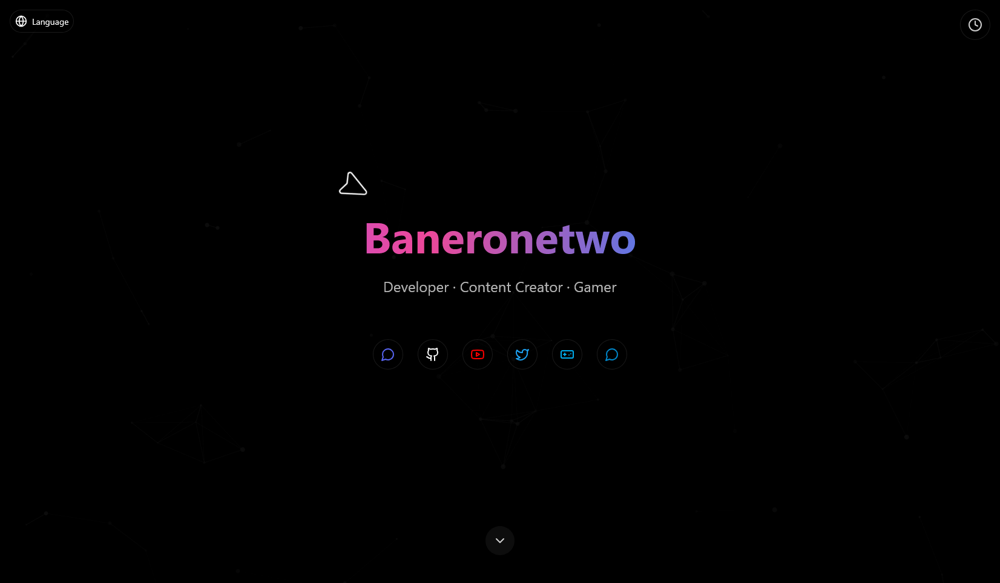

# Baneronetwo Web

<div align="center">

[](https://reactjs.org/)
[](https://www.typescriptlang.org/)
[](https://tailwindcss.com/)
[](https://vitejs.dev/)
[](https://www.radix-ui.com/)
[](https://react-hook-form.com/)
[](https://reactrouter.com/)
[](https://recharts.org/)

</div>

## 🌐 利用可能な言語

<div align="center">

[](README.md)
[](README.ru.md)
[](README.uk.md)
[](README.de.md)
[](README.ja.md)
[](README.pl.md)
[](README.zh-CN.md)
[](README.be.md)

</div>

---

## 概要

Baneronetwo Webは、React、TypeScript、Tailwind CSSを使用して構築された最新のレスポンシブWebアプリケーションです。Radix UIプリミティブをベースにしたUIコンポーネントが豊富に揃い、Tailwind CSSでスタイリングされており、あらゆるデバイスでシームレスなユーザー体験を提供します。

<div align="center">

</div>

## ✨ 特徴

- **最新のUIコンポーネント**: アコーディオン、ドロップダウンメニュー、ナビゲーションメニュー、セレクト入力、ダイアログ、ツールチップなど
- **レスポンシブデザイン**: モバイルからデスクトップまで、あらゆるデバイスで動作する完全に適応可能なレイアウト
- **型安全性**: より良い開発者体験とコード品質のためにTypeScriptで構築
- **高速開発**: 超高速ビルドとホットモジュール置換のためのViteを採用
- **国際化**: コンテキストベースの翻訳システムによる複数言語の完全サポート
- **フォームバリデーション**: 効率的なフォーム処理と検証のためのReact Hook Form統合
- **データ可視化**: Rechartsによる美しいチャートとグラフ
- **ルーティング**: React Routerによるシームレスなナビゲーション
- **テーマ設定**: 簡単にカスタマイズできるライトモードとダークモードのサポート

## 🚀 始め方

```bash
# リポジトリのクローン
git clone https://github.com/yourusername/baneronetwo-web.git
cd baneronetwo-web

# 依存関係のインストール
npm install

# 開発サーバーの起動
npm run dev

# 本番用ビルド
npm run build

# 本番ビルドのプレビュー
npm run preview
```

## 🛠️ 技術スタック

### コア技術

- **フロントエンドフレームワーク**: [React](https://reactjs.org/) - ユーザーインターフェースを構築するためのJavaScriptライブラリ
- **言語**: [TypeScript](https://www.typescriptlang.org/) - 型構文を持つJavaScript
- **スタイリング**: [Tailwind CSS](https://tailwindcss.com/) - ユーティリティファーストのCSSフレームワーク
- **ビルドツール**: [Vite](https://vitejs.dev/) - 次世代フロントエンドツーリング

### UIコンポーネント

- **コンポーネントライブラリ**: [Radix UI](https://www.radix-ui.com/) - 高品質なデザインシステムを構築するためのスタイルなし、アクセシブルなコンポーネント
- **アイコン**: [Lucide Icons](https://lucide.dev/) - 美しく一貫性のあるアイコン
- **タイポグラフィ**: Tailwind CSSをベースにしたカスタムタイポグラフィシステム

### 状態管理とデータ処理

- **フォーム処理**: [React Hook Form](https://react-hook-form.com/) - パフォーマンスが高く、柔軟で拡張可能なフォーム
- **データフェッチング**: [SWR](https://swr.vercel.app/) - データフェッチング用のReact Hooks
- **データ可視化**: [Recharts](https://recharts.org/) - ReactとD3で構築された再定義されたチャートライブラリ

### ルーティングとナビゲーション

- **ルーティング**: [React Router](https://reactrouter.com/) - Reactの宣言的ルーティング

### 開発ツール

- **リンティング**: カスタム設定のESLint
- **フォーマッティング**: Prettier
- **テスト**: VitestとReact Testing Library

## 📂 プロジェクト構造

```
├── src/                  # ソースファイル
│   ├── components/       # 再利用可能なUIコンポーネント
│   ├── context/          # Reactコンテキストプロバイダー
│   ├── hooks/            # カスタムReactフック
│   ├── lib/              # ユーティリティライブラリ
│   ├── pages/            # アプリケーションページ
│   ├── translations/     # 国際化ファイル
│   └── utils/            # ユーティリティ関数
├── public/               # 静的アセット
└── ...                   # 設定ファイル
```

## 🌍 国際化

Baneronetwo Webは、コンテキストベースの翻訳システムを通じて複数の言語をサポートしています。アプリケーションはユーザーの優先言語を検出し、利用可能な場合はその言語でコンテンツを自動的に表示します。

サポートされている言語:
- 英語 (English)
- ロシア語 (Русский)
- ウクライナ語 (Українська)
- ドイツ語 (Deutsch)
- 日本語
- ポーランド語 (Polski)
- 簡体字中国語 (简体中文)
- ベラルーシ語 (Беларуская)

## 🤝 貢献

貢献は歓迎します！お気軽にPull Requestを提出してください。

## 📄 ライセンス

このプロジェクトはMITライセンスの下でライセンスされています - 詳細についてはLICENSEファイルを参照してください。